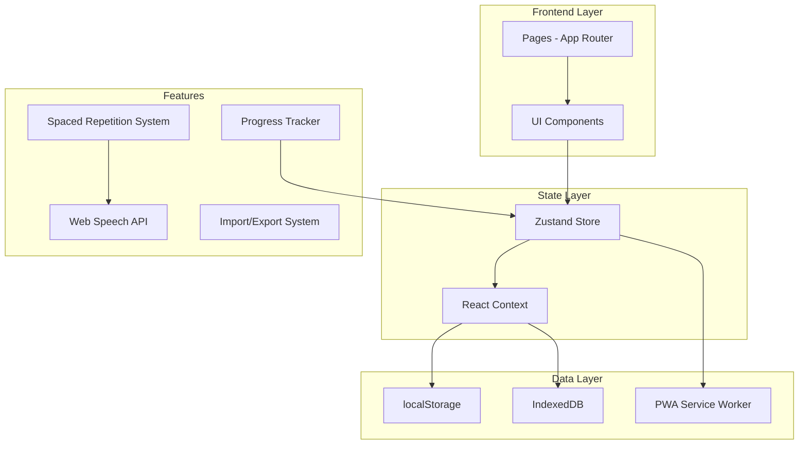
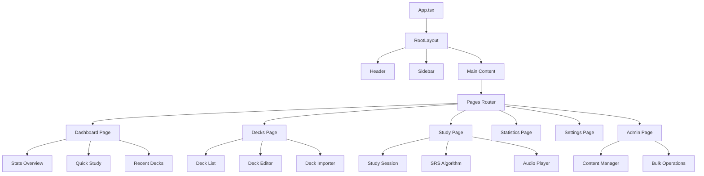

# Spanish Flashcard Application - Architecture Plan

## Overview

A comprehensive Spanish language learning flashcard web application built with Next.js 14, TypeScript, and Tailwind CSS. The application focuses on core flashcard functionality with spaced repetition, offline support, and progress tracking.

## Technology Stack

- **Framework**: Next.js 14 (App Router)
- **Language**: TypeScript
- **Styling**: Tailwind CSS
- **State Management**: Zustand + React Context
- **Data Persistence**: localStorage + IndexedDB
- **PWA**: Service Workers + Web App Manifest
- **Audio**: Web Speech API
- **Icons**: Lucide React

## Architecture Diagram



## Data Models

### Flashcard Interface

```typescript
interface Flashcard {
  id: string;
  front: string;           // Spanish word/phrase
  back: string;            // English translation
  type: 'vocabulary' | 'grammar' | 'verb' | 'sentence';
  pronunciation?: string;  // IPA or phonetic guide
  example?: string;        // Example sentence
  notes?: string;          // Additional notes
  difficulty: 1 | 2 | 3 | 4 | 5;
  createdAt: Date;
  updatedAt: Date;
}

interface Deck {
  id: string;
  name: string;
  description: string;
  category: string;
  difficulty: 'beginner' | 'intermediate' | 'advanced';
  cards: string[];         // Array of card IDs
  isPublic: boolean;
  author?: string;
  createdAt: Date;
  updatedAt: Date;
}

interface UserProgress {
  cardId: string;
  easeFactor: number;      // SM-2 ease factor (2.5 default)
  interval: number;        // Days until next review
  repetitions: number;     // Number of successful reviews
  nextReview: Date;
  lastReview?: Date;
}

interface SessionStats {
  cardsStudied: number;
  correctAnswers: number;
  incorrectAnswers: number;
  timeSpent: number;       // Seconds
  streak: number;
  retentionRate: number;
}
```

## Spaced Repetition Algorithm (SM-2)

### Algorithm Parameters

```typescript
interface SRSParams {
  MIN_EASE_FACTOR: 1.3;
  DEFAULT_EASE_FACTOR: 2.5;
  EASY_BONUS: 1.3;
  INTERVAL_MODIFIER: 1.0;
  NEW_CARD_LIMIT: 20;
  REVIEW_CARD_LIMIT: 50;
}
```

### Review Logic

```typescript
function calculateNextReview(
  card: UserProgress,
  quality: 0 | 1 | 2 | 3 | 4 | 5  // 0-2: incorrect, 3-5: correct
): UserProgress {
  // Quality: 0-2 = incorrect, 3 = correct (hard), 4 = correct (good), 5 = correct (easy)
  
  let { easeFactor, interval, repetitions } = card;
  
  if (quality < 3) {
    // Reset on incorrect answer
    repetitions = 0;
    interval = 1;
  } else {
    // Calculate new interval
    if (repetitions === 0) {
      interval = 1;
    } else if (repetitions === 1) {
      interval = 6;
    } else {
      interval = Math.round(interval * easeFactor);
    }
    repetitions++;
  }
  
  // Update ease factor based on quality
  easeFactor = easeFactor + (0.1 - (5 - quality) * (0.08 + (5 - quality) * 0.02));
  easeFactor = Math.max(1.3, easeFactor);
  
  return {
    ...card,
    easeFactor,
    interval,
    repetitions,
    nextReview: new Date(Date.now() + interval * 24 * 60 * 60 * 1000)
  };
}
```

## Flashcard Modes

### 1. Vocabulary Mode
- Simple word-translation pairs
- Audio pronunciation on demand
- Example sentences
- Part of speech tagging

### 2. Grammar Mode
- Concept explanations
- Fill-in-the-blank questions
- Rule-based answers
- Multiple choice options

### 3. Verb Conjugation Mode
- Verb tense selection
- Pronoun-verb matching
- Irregular verb handling
- Conjugation tables

### 4. Sentence Construction Mode
- Word ordering exercises
- Translation practice
- Drag-and-drop interface
- Grammar validation

## UI/UX Design System

### Color Palette

```css
:root {
  --primary: #3b82f6;      /* Blue */
  --primary-dark: #1d4ed8;
  --secondary: #10b981;    /* Green */
  --accent: #f59e0b;       /* Amber */
  --background: #f8fafc;
  --surface: #ffffff;
  --text-primary: #1e293b;
  --text-secondary: #64748b;
  --error: #ef4444;
  --success: #22c55e;
  --warning: #f59e0b;
}
```

### Typography

- **Headings**: Inter (sans-serif)
- **Body**: Inter (sans-serif)
- **Spanish text**: Special handling for accents and special characters

### Responsive Breakpoints

```css
/* Mobile First */
--mobile: 320px;
--tablet: 768px;
--desktop: 1024px;
--wide: 1280px;
```

## Progress Tracking System

### Statistics Dashboard

```typescript
interface Statistics {
  totalCardsLearned: number;
  totalTimeSpent: number;  // Seconds
  currentStreak: number;   // Days
  longestStreak: number;
  retentionRate: number;   // Percentage
  dailyGoal: number;       // Cards per day
  dailyProgress: number;
  weeklyActivity: DailyActivity[];
  masteryLevels: MasteryLevel[];
}

interface DailyActivity {
  date: string;
  cardsStudied: number;
  correctAnswers: number;
  timeSpent: number;
}

interface MasteryLevel {
  level: number;
  cardsRequired: number;
  title: string;
  icon: string;
}
```

### Streak Calculation

```typescript
function calculateStreak(activity: DailyActivity[]): number {
  if (activity.length === 0) return 0;
  
  const sorted = activity.sort((a, b) => 
    new Date(b.date).getTime() - new Date(a.date).getTime()
  );
  
  let streak = 0;
  const today = new Date();
  today.setHours(0, 0, 0, 0);
  
  for (const day of sorted) {
    const dayDate = new Date(day.date);
    dayDate.setHours(0, 0, 0, 0);
    
    const diffDays = (today.getTime() - dayDate.getTime()) / (1000 * 60 * 60 * 24);
    
    if (diffDays <= streak + 1 && day.cardsStudied > 0) {
      streak++;
    } else if (diffDays > streak + 1) {
      break;
    }
  }
  
  return streak;
}
```

## Audio System (Web Speech API)

### Speech Synthesis

```typescript
function speakSpanish(text: string): Promise<void> {
  return new Promise((resolve, reject) => {
    if (!('speechSynthesis' in window)) {
      reject(new Error('Speech synthesis not supported'));
      return;
    }
    
    const utterance = new SpeechSynthesisUtterance(text);
    utterance.lang = 'es-ES';
    utterance.rate = 0.9;  // Slightly slower for learning
    utterance.pitch = 1;
    
    // Select Spanish voice
    const voices = speechSynthesis.getVoices();
    const spanishVoice = voices.find(v => v.lang.startsWith('es'));
    if (spanishVoice) {
      utterance.voice = spanishVoice;
    }
    
    utterance.onend = () => resolve();
    utterance.onerror = (e) => reject(e);
    
    speechSynthesis.speak(utterance);
  });
}
```

## PWA Implementation

### Service Worker Strategy

```typescript
// Cache-first for static assets
// Network-first for API calls (if any)
// Stale-while-revalidate for deck data

const CACHE_NAME = 'spanish-flashcards-v1';
const STATIC_ASSETS = [
  '/',
  '/manifest.json',
  '/icons/*.png'
];

self.addEventListener('install', (event) => {
  event.waitUntil(
    caches.open(CACHE_NAME).then((cache) => {
      return cache.addAll(STATIC_ASSETS);
    })
  );
});

self.addEventListener('fetch', (event) => {
  // Implement caching strategies
});
```

### Web App Manifest

```json
{
  "name": "Spanish Flashcards",
  "short_name": "Flashcards",
  "start_url": "/",
  "display": "standalone",
  "background_color": "#f8fafc",
  "theme_color": "#3b82f6",
  "icons": [
    { "src": "/icons/icon-192.png", "sizes": "192x192", "type": "image/png" },
    { "src": "/icons/icon-512.png", "sizes": "512x512", "type": "image/png" }
  ]
}
```

## Import/Export System

### Export Format (JSON)

```typescript
interface DeckExport {
  version: string;
  exportedAt: string;
  deck: Deck;
  cards: Flashcard[];
  progress?: Record<string, UserProgress>;
}

function exportDeck(deck: Deck, cards: Flashcard[]): void {
  const data: DeckExport = {
    version: '1.0',
    exportedAt: new Date().toISOString(),
    deck,
    cards
  };
  
  const blob = new Blob([JSON.stringify(data, null, 2)], { 
    type: 'application/json' 
  });
  
  const url = URL.createObjectURL(blob);
  const a = document.createElement('a');
  a.href = url;
  a.download = `${deck.name.replace(/\s+/g, '-').toLowerCase()}.json`;
  a.click();
  URL.revokeObjectURL(url);
}
```

### Import Format

```typescript
async function importDeck(file: File): Promise<{ deck: Deck; cards: Flashcard[] }> {
  const text = await file.text();
  const data = JSON.parse(text) as DeckExport;
  
  // Validate format
  if (!data.version || !data.deck || !data.cards) {
    throw new Error('Invalid deck format');
  }
  
  // Generate new IDs to avoid conflicts
  const cardIdMap = new Map<string, string>();
  
  const cards = data.cards.map(card => {
    const newId = crypto.randomUUID();
    cardIdMap.set(card.id, newId);
    return { ...card, id: newId };
  });
  
  const deck = {
    ...data.deck,
    id: crypto.randomUUID(),
    cards: cards.map(c => c.id),
    createdAt: new Date(),
    updatedAt: new Date()
  };
  
  return { deck, cards };
}
```

## File Structure

```
spanish-flashcards/
├── app/
│   ├── globals.css
│   ├── layout.tsx
│   ├── manifest.ts
│   ├── page.tsx
│   ├── dashboard/
│   │   └── page.tsx
│   ├── decks/
│   │   ├── page.tsx
│   │   ├── [id]/
│   │   │   ├── page.tsx
│   │   │   └── study/
│   │   │       └── page.tsx
│   │   ├── create/
│   │   │   └── page.tsx
│   │   └── edit/
│   │       └── [id]/
│   │           └── page.tsx
│   ├── study/
│   │   └── page.tsx
│   ├── stats/
│   │   └── page.tsx
│   ├── settings/
│   │   └── page.tsx
│   └── admin/
│       └── page.tsx
├── components/
│   ├── ui/
│   │   ├── Button.tsx
│   │   ├── Card.tsx
│   │   ├── Modal.tsx
│   │   ├── Input.tsx
│   │   ├── Select.tsx
│   │   ├── ProgressBar.tsx
│   │   ├── Badge.tsx
│   │   └── Toast.tsx
│   ├── flashcard/
│   │   ├── Flashcard.tsx
│   │   ├── FlashcardFront.tsx
│   │   ├── FlashcardBack.tsx
│   │   ├── FlashcardList.tsx
│   │   └── CardEditor.tsx
│   ├── deck/
│   │   ├── DeckCard.tsx
│   │   ├── DeckList.tsx
│   │   ├── DeckStats.tsx
│   │   └── DeckImporter.tsx
│   ├── study/
│   │   ├── StudySession.tsx
│   │   ├── StudyControls.tsx
│   │   ├── AnswerButtons.tsx
│   │   ├── ProgressIndicator.tsx
│   │   └── SRSFeedback.tsx
│   ├── stats/
│   │   ├── StatisticsCard.tsx
│   │   ├── StreakDisplay.tsx
│   │   ├── RetentionChart.tsx
│   │   └── ActivityHeatmap.tsx
│   ├── audio/
│   │   ├── AudioPlayer.tsx
│   │   └── PronunciationButton.tsx
│   └── layout/
│       ├── Header.tsx
│       ├── Sidebar.tsx
│       ├── Navigation.tsx
│       └── Footer.tsx
├── lib/
│   ├── srs.ts           // Spaced repetition algorithm
│   ├── storage.ts       // localStorage/IndexedDB helpers
│   ├── audio.ts         // Web Speech API integration
│   ├── stats.ts         // Statistics calculations
│   ├── import-export.ts // Deck import/export
│   ├── validation.ts    // Data validation
│   └── utils.ts         // Utility functions
├── store/
│   ├── useDeckStore.ts
│   ├── useProgressStore.ts
│   ├── useStatsStore.ts
│   └── useSettingsStore.ts
├── hooks/
│   ├── useLocalStorage.ts
│   ├── useIndexedDB.ts
│   ├── useSpeechSynthesis.ts
│   └── useOnlineStatus.ts
├── types/
│   ├── index.ts
│   ├── deck.ts
│   ├── flashcard.ts
│   └── srs.ts
├── public/
│   ├── manifest.json
│   ├── icons/
│   └── fonts/
├── next.config.ts
├── tailwind.config.ts
├── tsconfig.json
└── package.json
```

## State Management

### Zustand Stores

```typescript
// Deck Store
interface DeckStore {
  decks: Deck[];
  currentDeck: Deck | null;
  setDecks: (decks: Deck[]) => void;
  addDeck: (deck: Deck) => void;
  updateDeck: (id: string, updates: Partial<Deck>) => void;
  deleteDeck: (id: string) => void;
  setCurrentDeck: (deck: Deck | null) => void;
}

// Progress Store
interface ProgressStore {
  progress: Record<string, UserProgress>;
  getCardProgress: (cardId: string) => UserProgress | undefined;
  updateCardProgress: (cardId: string, progress: UserProgress) => void;
  getCardsForReview: (deckId: string, limit: number) => string[];
  getDueCardsCount: (deckId: string) => number;
}

// Stats Store
interface StatsStore {
  stats: Statistics;
  todayActivity: DailyActivity;
  updateStats: (updates: Partial<Statistics>) => void;
  recordSession: (session: SessionStats) => void;
  calculateRetention: () => number;
}

// Settings Store
interface SettingsStore {
  settings: UserSettings;
  updateSettings: (settings: Partial<UserSettings>) => void;
  resetSettings: () => void;
}

interface UserSettings {
  dailyGoal: number;
  autoPlayAudio: boolean;
  showPronunciation: boolean;
  darkMode: boolean;
  notifications: boolean;
  language: string;
}
```

## Component Hierarchy



## Implementation Phases

### Phase 1: Core Infrastructure
- Project setup with Next.js 14
- TypeScript configuration
- Tailwind CSS setup
- Basic folder structure
- Type definitions

### Phase 2: Data Management
- Data models and interfaces
- localStorage utilities
- IndexedDB integration
- Import/export functionality

### Phase 3: Flashcard System
- Flashcard components
- Deck management
- Card editor
- Card display

### Phase 4: Study Mode
- Study session component
- SRS algorithm implementation
- Progress tracking
- Statistics calculation

### Phase 5: Audio System
- Web Speech API integration
- Audio player component
- Pronunciation features

### Phase 6: UI/UX
- Dashboard design
- Responsive layout
- Navigation system
- Visual polish

### Phase 7: PWA Features
- Service worker setup
- Offline support
- App manifest
- Install prompts

### Phase 8: Admin Panel
- Content management
- Bulk operations
- Statistics view
- Settings panel

## Key Decisions

1. **localStorage vs IndexedDB**: Use localStorage for simple data (settings, small decks), IndexedDB for large deck collections and media
2. **No gamification**: Focus on core spaced repetition functionality as requested
3. **Web Speech API**: Free, works offline, acceptable quality for language learning
4. **PWA first**: Ensure offline functionality from the start
5. **No authentication**: Local-only user data, export/import for backup/sharing

## Performance Considerations

- Lazy load components using Next.js dynamic imports
- Debounce search and filter operations
- Use React.memo for expensive renders
- Implement virtual scrolling for large card lists
- Compress exported deck files
- Cache API responses and computed statistics
